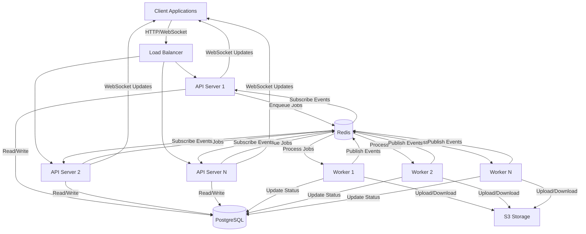
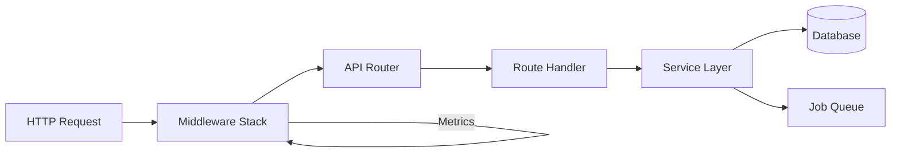
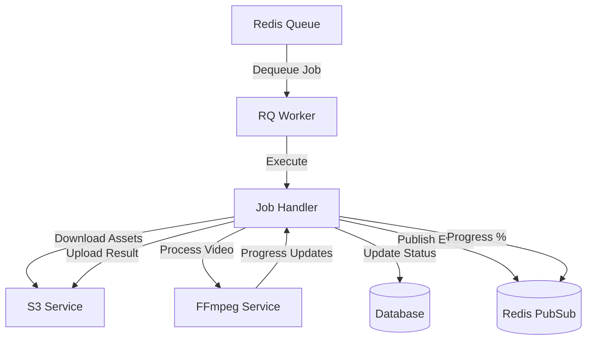
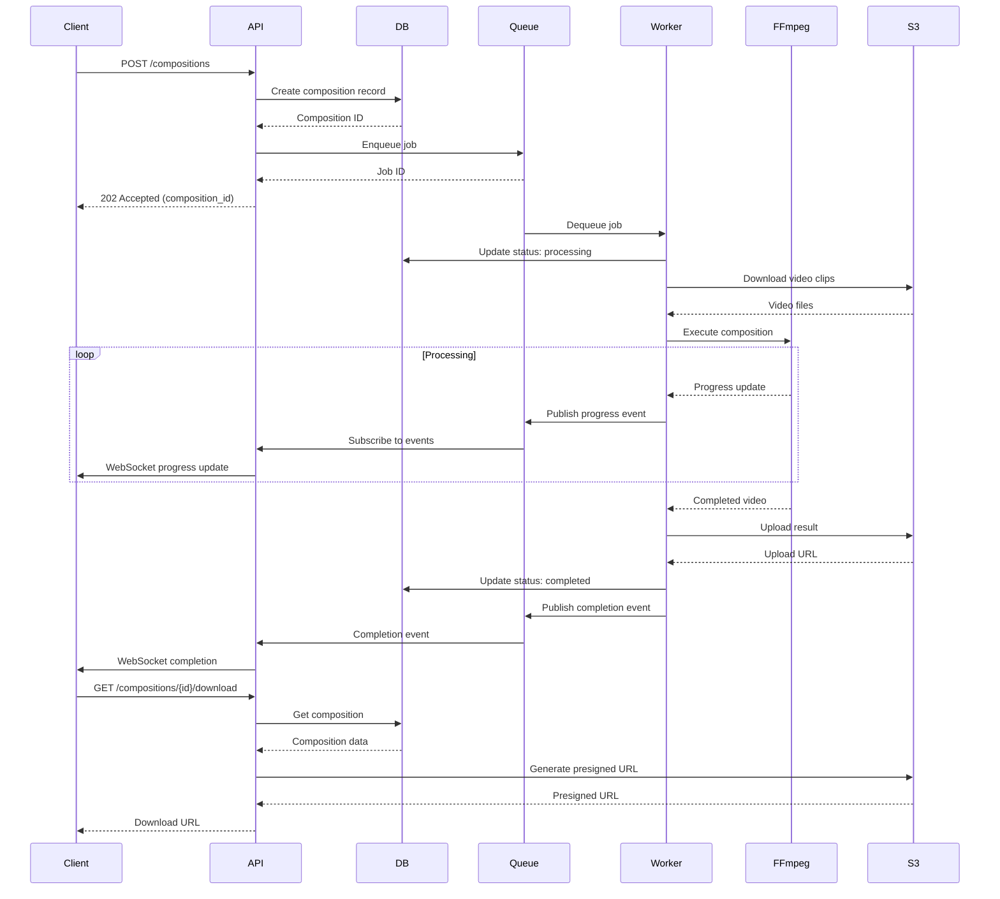
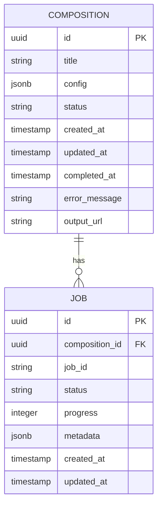
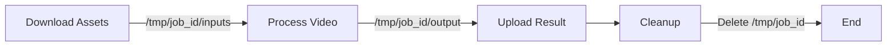
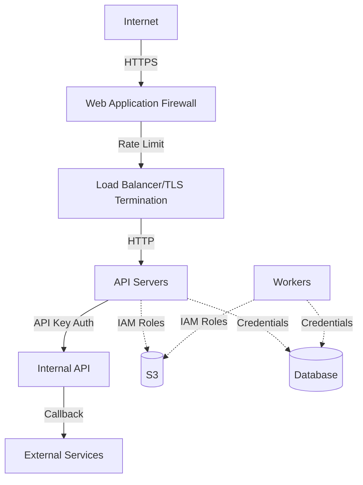
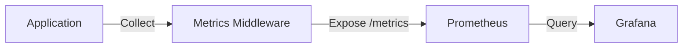
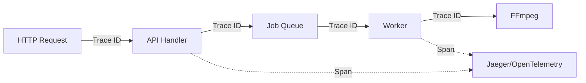

# System Architecture

## Overview

The FFmpeg Backend Service is a distributed system designed for asynchronous video processing using a microservices-inspired architecture. It leverages FastAPI for the web layer, PostgreSQL for persistence, Redis for job queuing, and FFmpeg for video processing.

## High-Level Architecture



## Component Architecture

### API Server



**Middleware Stack** (executed in order):
1. **RequestIDMiddleware**: Generates unique request ID
2. **LoggingMiddleware**: Structured logging for all requests
3. **MetricsMiddleware**: Collects request metrics
4. **InternalAuthMiddleware**: Authentication for internal endpoints
5. **RateLimitMiddleware**: Rate limiting per client
6. **CORSMiddleware**: Cross-origin resource sharing

### Worker Architecture



**Worker Process Flow**:
1. Dequeue job from Redis
2. Download video assets from S3
3. Execute FFmpeg command
4. Monitor FFmpeg progress
5. Publish progress updates to Redis
6. Upload processed video to S3
7. Update database with final status
8. Clean up temporary files

### Data Flow



## Database Schema



**Composition States**:
- `pending`: Composition created, waiting for processing
- `queued`: Job enqueued in Redis
- `processing`: Worker actively processing
- `completed`: Successfully processed
- `failed`: Processing failed with error

## Storage Architecture

### S3 Bucket Structure

```
s3://bucket-name/
├── inputs/
│   ├── {composition_id}/
│   │   ├── clip_0.mp4
│   │   ├── clip_1.mp4
│   │   ├── audio.mp3
│   │   └── overlay.png
├── outputs/
│   ├── {composition_id}/
│   │   ├── final.mp4
│   │   └── thumbnail.jpg
└── temp/
    └── {job_id}/
        └── intermediate_files/
```

### Temporary File Management



## Redis Architecture

### Job Queues

```
Queue Priorities:
├── high (priority: 10)
│   └── urgent compositions
├── default (priority: 5)
│   └── normal compositions
└── low (priority: 1)
    └── background tasks
```

### PubSub Channels

```
Channels:
├── composition:{composition_id}:progress
│   └── Progress updates (0-100%)
├── composition:{composition_id}:status
│   └── Status changes
└── composition:{composition_id}:error
    └── Error events
```

## Scaling Considerations

### Horizontal Scaling

**API Servers**:
- Stateless design allows unlimited horizontal scaling
- Load balancer distributes requests
- WebSocket connections use Redis PubSub for cross-instance communication

**Workers**:
- Add workers to increase concurrent job processing
- Each worker can process multiple jobs (based on CPU cores)
- Workers can be specialized by queue (high, default, low)

### Vertical Scaling

**API Servers**:
- Increase CPU for higher request throughput
- Increase memory for larger request payloads

**Workers**:
- Increase CPU cores for FFmpeg parallel processing
- Increase memory for processing large video files
- Increase disk I/O for faster temporary file operations

### Database Optimization

**Connection Pooling**:
```python
# SQLAlchemy async pool configuration
pool_size = 20  # Maximum connections
max_overflow = 10  # Additional connections under load
pool_timeout = 30  # Connection timeout
pool_recycle = 3600  # Recycle connections after 1 hour
```

**Indexes**:
```sql
CREATE INDEX idx_composition_status ON compositions(status);
CREATE INDEX idx_composition_created ON compositions(created_at DESC);
CREATE INDEX idx_job_composition_id ON jobs(composition_id);
CREATE INDEX idx_job_status ON jobs(status);
```

## Performance Characteristics

### Expected Throughput

| Metric | Value | Notes |
|--------|-------|-------|
| API Request Latency | < 100ms | P95 for GET requests |
| Composition Creation | < 200ms | Including DB write and job enqueue |
| Worker Processing | 1-5 min | Depends on video length and complexity |
| Concurrent Jobs | 5-10 | Per worker instance |
| API Requests/sec | 1000+ | With proper horizontal scaling |

### Resource Requirements

**API Server** (per instance):
- CPU: 2-4 cores
- Memory: 2-4 GB
- Disk: 10 GB
- Network: 1 Gbps

**Worker** (per instance):
- CPU: 4-8 cores (FFmpeg is CPU-intensive)
- Memory: 4-8 GB
- Disk: 50-100 GB (for temporary files)
- Network: 1 Gbps (for S3 uploads/downloads)

**Database**:
- CPU: 4-8 cores
- Memory: 8-16 GB
- Disk: 100+ GB SSD
- IOPS: 3000+ for production

**Redis**:
- CPU: 2-4 cores
- Memory: 4-8 GB
- Disk: 20 GB
- Persistence: AOF or RDB

## Security Architecture



**Security Layers**:
1. **Network**: WAF, DDoS protection, TLS 1.3
2. **Application**: Rate limiting, input validation, SQL injection prevention
3. **Authentication**: API keys for internal endpoints, JWT for user authentication
4. **Authorization**: Role-based access control (RBAC)
5. **Data**: Encryption at rest (S3, DB), encryption in transit (TLS)
6. **Secrets**: Environment variables, AWS Secrets Manager, HashiCorp Vault

## Monitoring and Observability

### Metrics



**Key Metrics**:
- Request rate (requests/sec)
- Request latency (P50, P95, P99)
- Error rate (4xx, 5xx)
- Active connections
- Queue depth
- Worker utilization
- Job completion time
- FFmpeg processing time

### Logging

**Structured Logging Format**:
```json
{
  "timestamp": "2024-01-15T10:30:00Z",
  "level": "INFO",
  "service": "ffmpeg-backend",
  "request_id": "550e8400-e29b-41d4-a716-446655440000",
  "composition_id": "123e4567-e89b-12d3-a456-426614174000",
  "message": "Composition processing started",
  "duration_ms": 150,
  "status_code": 200
}
```

### Distributed Tracing



## Disaster Recovery

### Backup Strategy

**Database**:
- Daily automated backups
- Point-in-time recovery
- Cross-region replication
- Retention: 30 days

**S3**:
- Versioning enabled
- Cross-region replication
- Lifecycle policies for old files
- Retention: 90 days for outputs

**Redis**:
- AOF persistence
- RDB snapshots every 6 hours
- Replica for high availability

### Recovery Procedures

1. **API Server Failure**: Auto-scaling group replaces failed instances
2. **Worker Failure**: Jobs automatically retry from queue
3. **Database Failure**: Failover to replica (< 30s downtime)
4. **Redis Failure**: Restart from persistence, re-enqueue jobs
5. **S3 Outage**: Retry with exponential backoff
