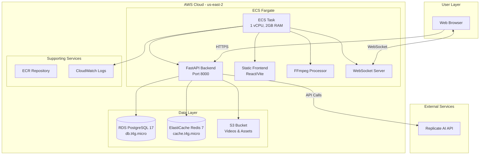
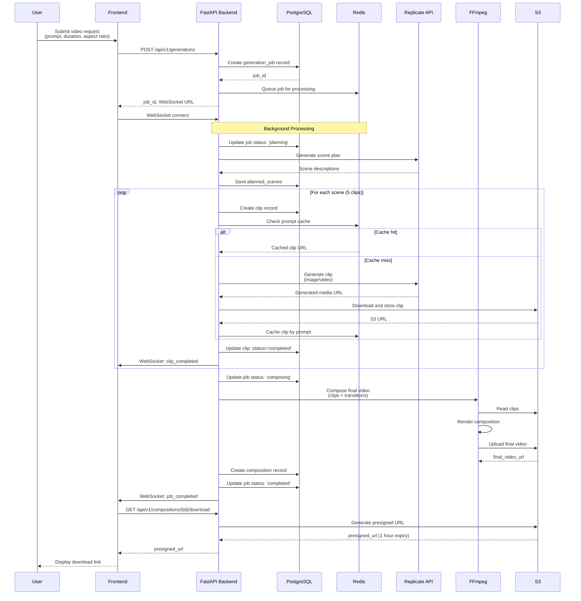
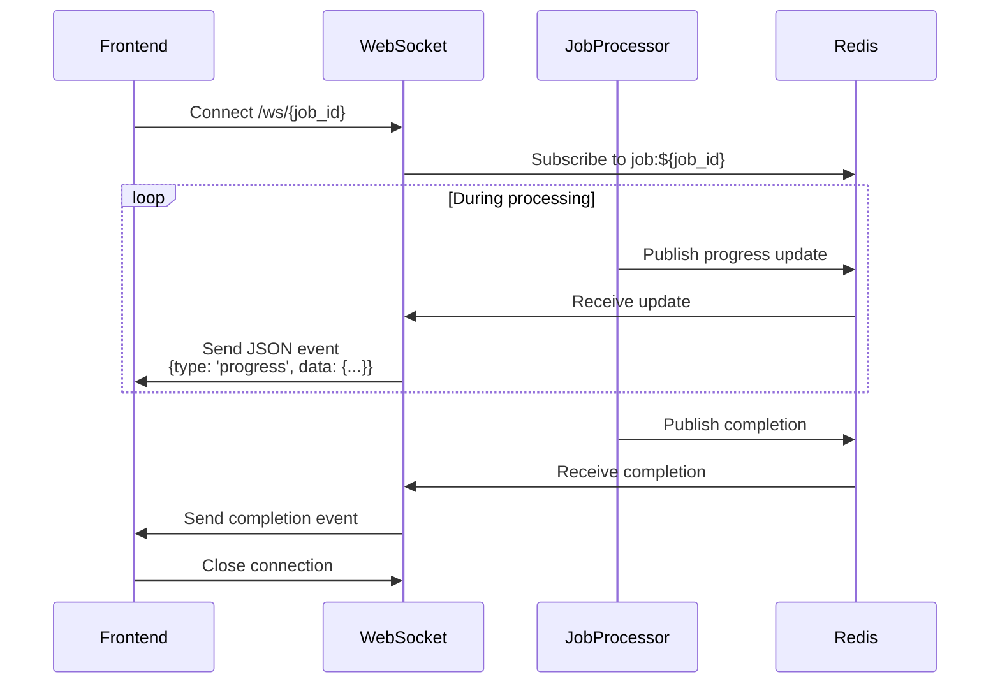
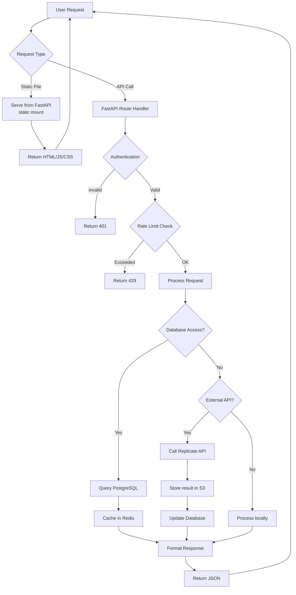
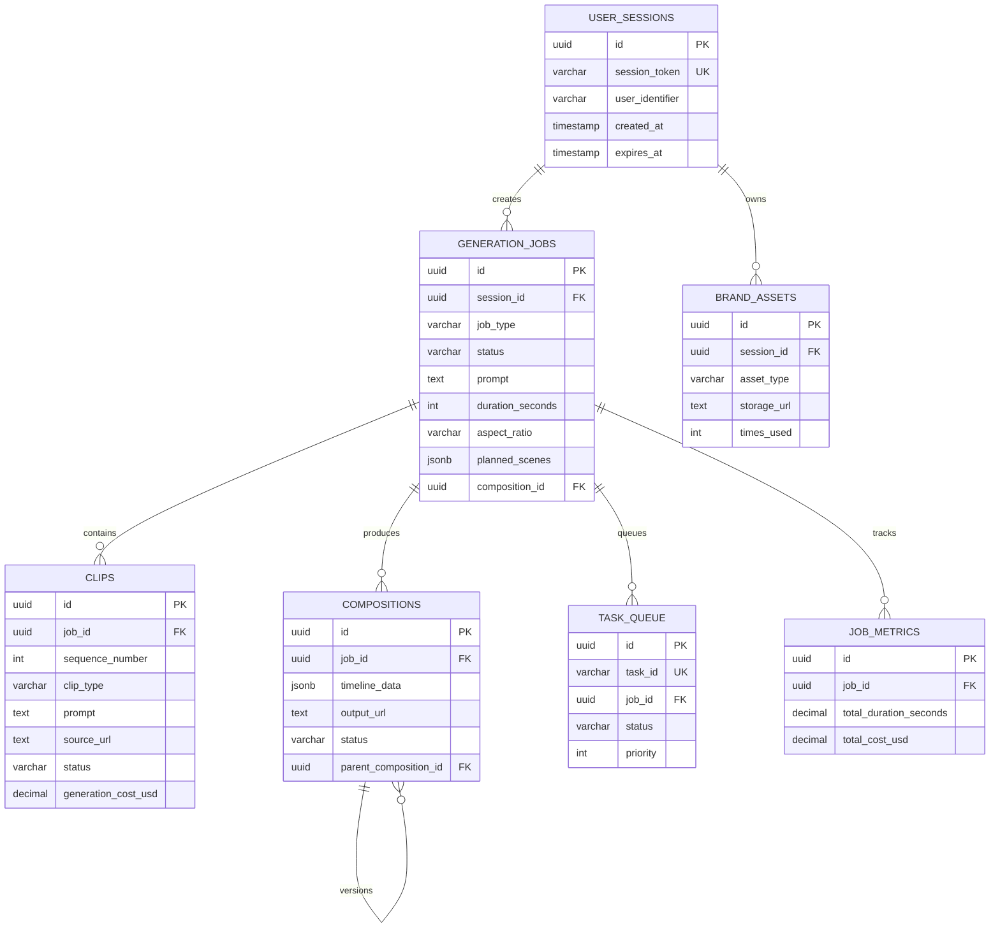

# System Architecture
## AI Video Generation Pipeline

This document describes the complete system architecture for the AI Video Generation Pipeline, including infrastructure components, data flow, and deployment model.

**Last Updated:** 2025-11-15
**Version:** 1.0.0 (MVP)
**Deployment Model:** Option B (FastAPI serves static frontend files in single container)
**Region:** us-east-2

---

## Table of Contents

1. [High-Level Architecture](#high-level-architecture)
2. [Component Interactions](#component-interactions)
3. [Network Architecture](#network-architecture)
4. [Data Flow Diagrams](#data-flow-diagrams)
5. [Technology Stack](#technology-stack)
6. [Deployment Model](#deployment-model)
7. [Database Schema](#database-schema)
8. [S3 Storage Structure](#s3-storage-structure)

---

## High-Level Architecture

### System Overview (ASCII Diagram)

```
┌─────────────────────────────────────────────────────────────────────────┐
│                        AWS Cloud (us-east-2)                            │
│                                                                         │
│  ┌───────────────────────────────────────────────────────────────────┐ │
│  │                    Default VPC                                    │ │
│  │                                                                   │ │
│  │  ┌─────────────────────────────────────────────────────────────┐ │ │
│  │  │              ECS Fargate Service                            │ │ │
│  │  │  ┌───────────────────────────────────────────────────────┐  │ │ │
│  │  │  │          ECS Task (1 vCPU, 2GB RAM)                   │  │ │ │
│  │  │  │                                                        │  │ │ │
│  │  │  │  ┌──────────────────────────────────────────────┐     │  │ │ │
│  │  │  │  │   FastAPI Backend (Port 8000)                │     │  │ │ │
│  │  │  │  │   - REST API Endpoints                       │     │  │ │ │
│  │  │  │  │   - WebSocket Server (real-time updates)     │     │  │ │ │
│  │  │  │  │   - Static Frontend Files (React/Vite build) │     │  │ │ │
│  │  │  │  │   - FFmpeg Video Processing                  │     │  │ │ │
│  │  │  │  └──────────────────────────────────────────────┘     │  │ │ │
│  │  │  └───────────────────────────────────────────────────────┘  │ │ │
│  │  └─────────────────────────────────────────────────────────────┘ │ │
│  │                                                                   │ │
│  │  ┌─────────────────┐    ┌──────────────────┐    ┌────────────┐  │ │
│  │  │  RDS PostgreSQL │    │ ElastiCache Redis│    │ S3 Bucket  │  │ │
│  │  │  (db.t4g.micro) │    │ (cache.t4g.micro)│    │ (Videos/   │  │ │
│  │  │  - 9 Tables     │    │ - Session cache  │    │  Assets)   │  │ │
│  │  │  - 20GB Storage │    │ - Job queue      │    │ - Lifecycle│  │ │
│  │  └─────────────────┘    └──────────────────┘    └────────────┘  │ │
│  │                                                                   │ │
│  └───────────────────────────────────────────────────────────────────┘ │
│                                                                         │
│  ┌─────────────────┐    ┌──────────────────┐                          │
│  │  ECR Repository │    │  CloudWatch Logs │                          │
│  │  (Docker Images)│    │  (App Logging)   │                          │
│  └─────────────────┘    └──────────────────┘                          │
│                                                                         │
└─────────────────────────────────────────────────────────────────────────┘
                                    ▲
                                    │
                                    │ HTTPS
                                    │
                         ┌──────────┴─────────┐
                         │                    │
                    ┌────┴────┐          ┌────┴────┐
                    │  User   │          │  User   │
                    │ Browser │          │ Browser │
                    └─────────┘          └─────────┘

  External Services:
  ┌─────────────────────┐
  │  Replicate AI API   │
  │  (Image/Video Gen)  │
  └─────────────────────┘
```

### Mermaid Architecture Diagram



---

## Component Interactions

### Video Generation Flow



### WebSocket Real-Time Updates



### Asset Upload and Storage

```mermaid
graph LR
    A[User uploads logo] --> B[Frontend]
    B -->|POST /api/v1/assets/upload| C[FastAPI]
    C -->|Validate file type/size| D{Valid?}
    D -->|No| E[Return 400 error]
    D -->|Yes| F[Generate upload_id]
    F --> G[Save to S3:<br/>uploads/{user_id}/{upload_id}/]
    G --> H[Create brand_assets record]
    H --> I[Return asset_id, S3 URL]
    I --> B
    B --> J[Display uploaded asset]
```

---

## Network Architecture

### VPC Configuration

**Default VPC Setup:**
- **VPC ID:** Uses default VPC in us-east-2
- **Subnets:** Default subnets in all availability zones (us-east-2a, us-east-2b, us-east-2c)
- **Internet Gateway:** Default IGW for internet access
- **Route Tables:** Default route table with 0.0.0.0/0 → IGW

### Security Groups

#### 1. ECS Security Group (ai-video-ecs-sg)
```
Inbound Rules:
- Port 8000 (TCP) from 0.0.0.0/0  # API/Frontend access
- Port 8000 (TCP) from ::/0       # IPv6 support

Outbound Rules:
- All traffic to 0.0.0.0/0        # Internet access for Replicate API, ECR
```

#### 2. RDS Security Group (ai-video-rds-sg)
```
Inbound Rules:
- Port 5432 (TCP) from ECS Security Group  # PostgreSQL from ECS only

Outbound Rules:
- None (RDS doesn't initiate outbound connections)
```

#### 3. ElastiCache Security Group (ai-video-redis-sg)
```
Inbound Rules:
- Port 6379 (TCP) from ECS Security Group  # Redis from ECS only

Outbound Rules:
- None (ElastiCache doesn't initiate outbound connections)
```

### Network Diagram

```
┌────────────────────────────────────────────────────────────────┐
│                     Default VPC (us-east-2)                    │
│                     CIDR: 172.31.0.0/16                        │
│                                                                │
│  ┌──────────────────┐  ┌──────────────────┐  ┌─────────────┐ │
│  │  Subnet A (AZ-a) │  │  Subnet B (AZ-b) │  │ Subnet C    │ │
│  │  172.31.0.0/20   │  │  172.31.16.0/20  │  │ (AZ-c)      │ │
│  │                  │  │                  │  │             │ │
│  │  ┌────────────┐  │  │  ┌────────────┐  │  │             │ │
│  │  │ ECS Task   │  │  │  │ RDS Primary│  │  │  RDS Multi- │ │
│  │  │ (Fargate)  │──┼──┼─▶│ PostgreSQL │  │  │  AZ Standby │ │
│  │  │            │  │  │  │            │  │  │  (Future)   │ │
│  │  └────────────┘  │  │  └────────────┘  │  │             │ │
│  │        │         │  │                  │  │             │ │
│  │        └─────────┼──┼─────────────────┐│  │             │ │
│  │                  │  │                 ││  │             │ │
│  │  ┌────────────┐  │  │  ┌────────────┐││  │             │ │
│  │  │            │  │  │  │ ElastiCache│││  │             │ │
│  │  │            │──┼──┼─▶│   Redis    │││  │             │ │
│  │  │            │  │  │  │            │││  │             │ │
│  │  └────────────┘  │  │  └────────────┘││  │             │ │
│  └──────────────────┘  └─────────────────┘│  └─────────────┘ │
│           │                                │                  │
│           │ Internet Gateway               │                  │
│           ▼                                │                  │
│  ┌────────────────┐                        │                  │
│  │      IGW       │                        │                  │
│  └────────────────┘                        │                  │
└────────────────────────────────────────────────────────────────┘
         │
         │ Internet
         ▼
   ┌────────────┐      ┌─────────────────┐
   │   Users    │      │  Replicate API  │
   └────────────┘      └─────────────────┘
```

### Service Communication Patterns

```
User Browser
    │
    │ HTTPS (Port 8000)
    ▼
ECS Task (FastAPI)
    │
    ├──▶ RDS PostgreSQL (Port 5432, VPC-internal)
    │    - Database queries
    │    - Transaction management
    │
    ├──▶ ElastiCache Redis (Port 6379, VPC-internal)
    │    - Session storage
    │    - Job queue (Celery)
    │    - Caching
    │
    ├──▶ S3 (HTTPS, AWS internal network)
    │    - Upload/download videos
    │    - Store brand assets
    │    - Presigned URLs for user downloads
    │
    └──▶ Replicate API (HTTPS, public internet)
         - Image generation
         - Video generation
```

---

## Data Flow Diagrams

### Request Lifecycle



### Database Schema Relationships

Based on `/home/user/delicious-lotus/docker/postgres/init.sql`:



**9 Core Tables:**
1. `user_sessions` - Session tracking (anonymous for MVP)
2. `generation_jobs` - Video generation requests
3. `clips` - Individual generated video/image segments
4. `compositions` - Final assembled videos
5. `brand_assets` - User-uploaded logos/images/audio
6. `task_queue` - Celery task tracking
7. `job_metrics` - Performance and cost analytics
8. `system_config` - System-wide configuration
9. `schema_migrations` - Database version tracking

---

## Technology Stack

### Frontend Layer

| Component | Technology | Version | Purpose |
|-----------|-----------|---------|---------|
| **UI Framework** | React | 18.x | Component-based UI |
| **Build Tool** | Vite | 5.x | Fast development and bundling |
| **Language** | TypeScript | 5.x | Type-safe JavaScript |
| **Styling** | Tailwind CSS | 3.x | Utility-first CSS framework |
| **State Management** | React Context/Hooks | Built-in | Local state management |
| **HTTP Client** | Axios | 1.x | API communication |
| **WebSocket Client** | Native WebSocket API | Built-in | Real-time updates |
| **Routing** | React Router | 6.x | Client-side routing |

**Build Output:** Static files served by FastAPI from `/app/frontend/dist`

### Backend Layer

| Component | Technology | Version | Purpose |
|-----------|-----------|---------|---------|
| **Web Framework** | FastAPI | 0.104.x | Async REST API |
| **Language** | Python | 3.11 | Backend logic |
| **ASGI Server** | Uvicorn | 0.24.x | Production server |
| **Database ORM** | SQLAlchemy | 2.x | Database abstraction |
| **Migration Tool** | Alembic | 1.x | Schema migrations |
| **Task Queue** | Celery | 5.x | Async job processing |
| **Video Processing** | FFmpeg | 6.x | Video composition |
| **HTTP Client** | httpx | 0.25.x | Async HTTP requests |
| **WebSocket** | FastAPI WebSocket | Built-in | Real-time communication |
| **Validation** | Pydantic | 2.x | Request/response validation |

### AI Services

| Component | Provider | Purpose |
|-----------|----------|---------|
| **Image Generation** | Replicate (Stable Diffusion XL) | Generate static images for clips |
| **Video Generation** | Replicate (Deforum/AnimateDiff) | Generate short video clips |
| **Model Selection** | Configurable via env vars | Swap models based on quality/cost |

### Data Layer

| Component | Technology | Version | Configuration |
|-----------|-----------|---------|--------------|
| **Database** | PostgreSQL | 17 | RDS db.t4g.micro, 20GB gp3 |
| **Cache/Queue** | Redis | 7.x | ElastiCache cache.t4g.micro |
| **Object Storage** | AWS S3 | - | Standard storage class + Intelligent Tiering |

### Infrastructure Layer

| Component | Technology | Purpose |
|-----------|-----------|---------|
| **Container Platform** | AWS ECS Fargate | Serverless container orchestration |
| **Container Registry** | AWS ECR | Docker image storage |
| **Infrastructure as Code** | Terraform | AWS resource provisioning |
| **CI/CD** | Docker + Bash scripts | Build and deployment automation |
| **Logging** | CloudWatch Logs | Centralized log aggregation |
| **Monitoring** | CloudWatch Metrics | Performance monitoring |

### DevOps Tools

| Tool | Purpose |
|------|---------|
| Docker | Containerization |
| Docker Compose | Local development orchestration |
| Terraform | Infrastructure provisioning |
| AWS CLI | AWS resource management |
| Bash Scripts | Deployment automation |

---

## Deployment Model

### Option B: Single Container Architecture

**Decision:** FastAPI serves both API and static frontend files in a single container.

**Rationale:**
- Simplifies deployment (single service instead of two)
- Reduces CORS complexity (same origin for API and frontend)
- Lower infrastructure costs (1 ECS task instead of 2)
- Easier local development
- Suitable for MVP traffic levels

**Trade-offs:**
- Frontend and backend deploy together (can't deploy independently)
- Backend restarts affect frontend availability
- Less flexible scaling (can't scale frontend/backend separately)

**Implementation:**

```python
# backend/app/main.py
from backend-api import FastAPI
from backend-api.staticfiles import StaticFiles

app = FastAPI()

# API routes
app.include_router(generations_router, prefix="/api/v1")
app.include_router(compositions_router, prefix="/api/v1")

# Serve frontend static files
app.mount("/", StaticFiles(directory="/app/frontend/dist", html=True), name="frontend")
```

**Container Structure:**
```
/app/
├── backend/              # FastAPI application
│   ├── main.py
│   ├── api/
│   ├── services/
│   └── models/
├── frontend/dist/        # Built React application
│   ├── index.html
│   ├── assets/
│   └── *.js, *.css
└── storage/              # Local storage (dev only)
```

**Routing:**
- `/api/v1/*` → FastAPI route handlers
- `/ws/*` → WebSocket handlers
- `/*` → Serve frontend static files (SPA fallback)

### ECS Task Configuration

```hcl
# From terraform/modules/ecs/main.tf
resource "aws_ecs_task_definition" "main" {
  family                   = var.task_family
  requires_compatibilities = ["FARGATE"]
  network_mode            = "awsvpc"
  cpu                     = var.task_cpu      # 1024 (1 vCPU)
  memory                  = var.task_memory   # 2048 (2 GB)

  container_definitions = jsonencode([{
    name  = "ai-video-backend"
    image = "${var.ecr_repository_url}:${var.container_image_tag}"

    portMappings = [{
      containerPort = 8000
      protocol      = "tcp"
    }]

    environment = [
      # See terraform/main.tf for full list
      { name = "DATABASE_URL", value = "..." }
      { name = "REDIS_URL", value = "..." }
      { name = "S3_BUCKET", value = "..." }
      # ... etc
    ]

    logConfiguration = {
      logDriver = "awslogs"
      options = {
        "awslogs-group"         = "/ecs/${var.environment}/ai-video-backend"
        "awslogs-region"        = var.aws_region
        "awslogs-stream-prefix" = "ecs"
      }
    }
  }])
}
```

---

## S3 Storage Structure

Reference: `/home/user/delicious-lotus/docs/storage-architecture.md`

```
s3://ai-video-{environment}-bucket/
├── uploads/
│   └── {user_id}/
│       └── {upload_id}/
│           ├── original.{ext}        # User-uploaded files
│           └── metadata.json
│
├── generations/
│   └── {generation_id}/
│       ├── clips/
│       │   ├── clip_001.mp4         # Generated clips
│       │   ├── clip_002.mp4
│       │   └── clip_00N.mp4
│       ├── audio/
│       │   └── background.mp3
│       ├── thumbnails/
│       │   ├── clip_001.jpg
│       │   └── clip_002.jpg
│       └── metadata.json
│
├── compositions/
│   └── {composition_id}/
│       ├── final.mp4                 # Final rendered video
│       ├── thumbnail.jpg
│       ├── timeline.json
│       └── metadata.json
│
└── temp/
    └── {job_id}/
        └── processing/
            ├── intermediate_*.mp4    # Auto-deleted after 7 days
            └── *.tmp
```

**Lifecycle Policies:**
- `temp/` → Delete after 7 days
- `generations/` → Delete after 30 days
- `compositions/` → Delete after 90 days
- `uploads/` → No auto-deletion (user content)

---

## Scalability Considerations

### Current Capacity (MVP)

- **Concurrent users:** ~5-10
- **Concurrent video generations:** 5 (configurable)
- **Database connections:** 10 (pool size)
- **Redis connections:** 50 (max)
- **ECS tasks:** 1 (can scale to 3-5)

### Bottlenecks

1. **Replicate API rate limits** - Primary constraint
2. **FFmpeg processing** - CPU-intensive (single task)
3. **Database connections** - Limited by pool size
4. **Single ECS task** - No redundancy

### Future Scaling Path

See `/home/user/delicious-lotus/docs/scaling.md` for detailed recommendations:

- Horizontal scaling (multiple ECS tasks + ALB)
- Database read replicas
- Redis cluster mode
- CDN for video delivery (CloudFront)
- Multi-region deployment

---

## Security Architecture

### Data at Rest
- **S3:** Server-side encryption (AES-256)
- **RDS:** Encryption enabled by default
- **Redis:** ElastiCache encryption in transit

### Data in Transit
- **Client ↔ ECS:** HTTPS (when ALB/domain configured)
- **ECS ↔ RDS:** SSL/TLS required
- **ECS ↔ Redis:** TLS support (optional for MVP)
- **ECS ↔ S3:** HTTPS (AWS internal network)

### Access Control
- **S3:** Private bucket, presigned URLs for temporary access
- **RDS:** VPC-only access, security group restrictions
- **Redis:** VPC-only access, security group restrictions
- **ECS:** IAM roles for S3/RDS/Redis access (no hardcoded credentials)

### Network Isolation
- **Public:** ECS task (port 8000)
- **Private:** RDS, ElastiCache (no internet access)
- **Firewalls:** Security groups enforce least privilege

---

## Monitoring & Observability

### CloudWatch Metrics

**ECS Service:**
- CPU utilization
- Memory utilization
- Task count (running/pending/stopped)

**RDS:**
- DatabaseConnections
- CPUUtilization
- FreeableMemory
- ReadIOPS, WriteIOPS

**ElastiCache:**
- CPUUtilization
- CacheHits, CacheMisses
- NetworkBytesIn, NetworkBytesOut

**S3:**
- BucketSizeBytes
- NumberOfObjects

### CloudWatch Logs

**Log Groups:**
- `/ecs/${environment}/ai-video-backend` - Application logs
  - Request/response logs
  - Error logs
  - Performance logs

**Log Retention:** 7 days (configurable)

### Application Metrics (Future)

- Video generation success rate
- Average generation time
- Replicate API costs per job
- Cache hit ratio
- User session metrics

---

## Disaster Recovery

### Backup Strategy

**Database:**
- RDS automated backups (daily)
- Retention: 7 days
- Point-in-time recovery enabled

**S3:**
- Versioning: Not enabled (cost optimization)
- Cross-region replication: Not enabled (MVP)

**Infrastructure:**
- Terraform state stored locally (future: S3 + DynamoDB locking)
- Infrastructure as Code (can rebuild entire stack)

### Recovery Procedures

**Database failure:**
1. Restore from RDS automated backup
2. Re-run migrations if needed
3. Update ECS task environment variable

**ECS task failure:**
- Auto-recovery: ECS automatically restarts failed tasks
- Manual: Force new deployment

**S3 data loss:**
- No automated recovery (lifecycle policies delete data)
- Prevention: Disable lifecycle policies for critical data

---

## References

- [Deployment Guide](./deployment-guide.md)
- [Troubleshooting Guide](./troubleshooting.md)
- [Storage Architecture](./storage-architecture.md)
- [Environment Setup](./environment-setup.md)
- [Database Schema](../docker/postgres/init.sql)
- [Terraform Configuration](../terraform/)

---

**Architecture Document Version:** 1.0.0
**Last Updated:** 2025-11-15
**Maintained by:** DevOps Team
